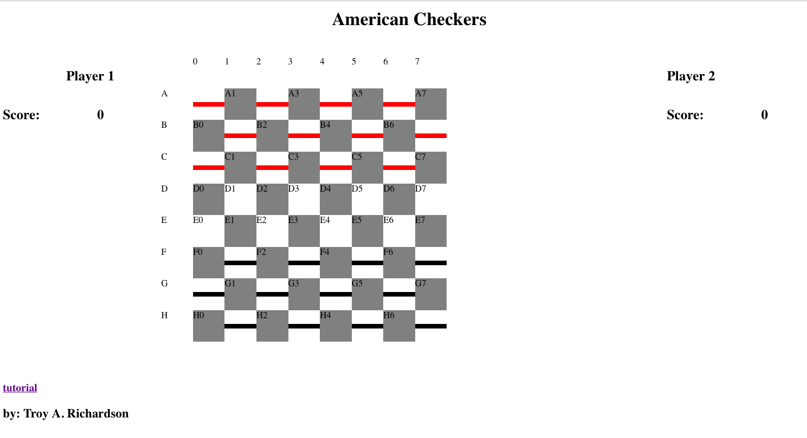
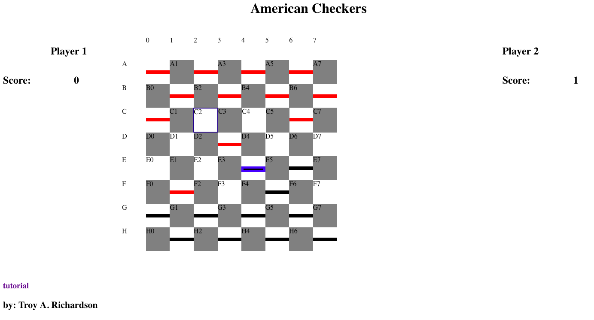

# Project 1 Checkers Proposal/MVP

_Introduction_
This is a basic game of the checkers board game, American checkers. Using rules from the website https://www.itsyourturn.com/t_helptopic2030.html. Tutorial Section:


## Deployment
  * glistening-apples.surge.sh

## Technologies to be used:
  * HTML
  * CSS
  * JavaScript

## Project Risks.
  - The jumping the opponent.
  - The Crowning the the checker.
  - Multi-jumps.
  
## solving.
  - Depending on the direction the piece is going the location on the board will hold possibles jumps from that spot.
  - The crowned checker piece will need to move in both direction. I will store a bool to let the move logic know to let the crowned piece move and jump in both direction.
  - Should it be auto after the 1st jump, because the rules said you must take all possibles jumps.


### Specifications
- Start button > select what color you want.
- Setup Board: needs 32x32 board - 32 dark squares.
- 2 players needed: with 12 pieces each on 3 rows each the player's side.
- player pieces: 'red' or 'black' color.
- win condition: Capture other player pieces or leave your opponent with no available moves
- lose condition: All 12 pieces from your side have been captured.
- draw condition: Both players are left with no available moves for any pieces on the board.
- progress is made by: the player will mark progress by the total pieces captured.
- captured pieces will be scored for each player.
- valid move 1a: It's when a player clicks there own piece then click on an open spot.
- valid move 1b: basic movement is to move a checker one space diagonal forward.
- valid move 1c: Can't move a checker backward until it becomes a king.
- valid move 1d: If jump is available you must take the jump.
- valid jump 2a: If one of your opponent's checker is on a forward diagonal nest to one of your checker, and the next space beyond the opponent's checker is empty.
- valid jump 2b: After making one jump, your checker might have another jump available from its new position. Your checker must take that jump too.
- valid jump 2c: Must continue to jump until there are no more jumps available.
- valid jump rule: If you have a valid jump, you must jump.
- invalid move - is when a player clicks on any non-open -spot and no jump possibles are available.
- invalid jump - the next space beyond the opponent is not empty when jumping.
- The player will get a message "invalid move Player#" when make invalid moves.
- Message using the DOM
- Crowning 3a: When one of your checkers reaches the opposite side of the board, it is crowned and become a king. Your turn ends when kinged.
- Crowning 3b: A king can move backward and forward one space at a time.

### MVP
- Setup Board: needs 32x32 board - 32 dark squares.
- 2 players needed: with 12 pieces each on 3 rows each the player's side.
- player pieces: 'red' or 'black' color.
- message using console
- win condition: Capture other player pieces or leave your opponent with no available moves
- lose condition: All 12 pieces from your side have been captured.
- draw condition: Both players are left with no available moves for any pieces on the board.
- progress is made by: the player will mark progress by the total pieces captured.
- valid move 1a: It's when a player clicks there own piece then click on an open spot.
- valid move 1b: basic movement is to move a checker one space diagonal forward.
- valid move 1c: Can't move a checker backward until it becomes a king.
- valid move 1d: If jump is available you must take the jump.
- valid jump 2a: If one of your opponent's checker is on a forward diagonal nest to one of your checker, and the next space beyond the opponent's checker is empty.
- valid jump rule: If you have a valid jump, you must jump.
- invalid move - is when a player clicks on any non-open -spot and no jump possibles are available.
- invalid jump - the next space beyond the opponent is not empty when jumping.
- Crowning 3a: When one of your checkers reaches the opposite side of the board, it is crowned and become a king. Your turn ends when kinged.
- Crowning 3b: A king can move backward and forward one space at a time.

### Tasks
- see specifications, each on should take an 2 hr 30 min

```javascript
- const gameState = {
  gameRunning: true,
  winner: false,
  p1Turn: true,             // true if player 1 turn, false if player 2 turn.
  Player: [
    {
      id: 1,                // player id will be use on the internal board
      name: 'Player 1',     // player name that is displayed.
      color: 'red',         // player color of checkers.
      score: 0,             // pieces captured from opponent
      pieces: [             // has the 12 pieces
        {
          king: false,      // king has different move logic
          location: 'A0',   // location on board.
          direction: 'down',// are your pieces moving 'up', 'down', or 'both' on the board.
          captured: false,  // if captured that pieces is removed from the board.
        },
          {}]
    },
    {
      id: 2,
      name: 'Player 1',
      color: 'black',
      Score: 0,
      pieces:
    }],
  gameBoard: {
    A:[0,0,0.....],
    B:[0,0,0.....],
    C:[0,0,0.....]
  }

}
```

```javascript
- const gameUpdate = () => {
  if(gameState.gameRunning){
    checkWin();
    displayGame();
  }
}
```
## Last Input Refinement Goals.
# Goal 1: 1st Selection
- player should only be able to select there own checker piece.
- process selection.
-   - if valid highlight the Selection.
-       * process possible moves/jumps.
-       * highlight possible moves.
-       * update display
-       * transition to 2nd selection phase.
-   - else invalid do nothing to selection.
# Goal 2: 2nd Selection
- player can select:
-    1) possible jumps/moves.
-    2) own/same checker piece.
-  - if valid jump
-     * player's checker move to new spot other player checker is removed from board.
-     * update to player's pieces, king if needed
-     * update to other player's pieces, remove it from play
-     * update to player score
-     * clear all 3 select lists
-     * switch player turn
-     * update display
-     * transition to 1st selection phase.
-  - else if valid moved
-     * player's checker move to new spot
-     * update to player's pieces, king if needed
-     * clear all 3 select lists
-     * switch player turn
-     * update display
-     * transition to 1st selection phase.
-  - else if own checker piece.
-     * clear all 3 select lists
-     * force call to 1st selection phase.
-  - else if same checker piece.
-     * clear all 3 select lists
-     * update display
-     * transition to 1st selection phase.
-   - else invalid do nothing to selection.
# Goal 3: calling Functions
- it's hard to debugger inline Functions call in inline function calls to get parameters
-     * fix by store function parameters in variables before hand.
-     * send in all parameters needed for the function.
# Goal 4: clean up the code
- for readability have function that do a lot more. then just get a value.
- rename function that makes sense, even if the name is longer.


Log         | Task
----------- | ---------------------------------------------------------------
Oct 24 2018 | fill out the jumps for each spot. Move pieces on board. jumping
Oct 25 2018 | working on HTML and updating the DOM with game data.
Oct 26 2018 | processing user input.
codePen     | https://codepen.io/TARichardson/pen/pxGrpK?editors=1111
codePen2    | https://codepen.io/TARichardson/pen/ePxezg?editors=1111
proud of    | the highlighting
Oct 27 2018 | refinement of the input system is need to stabilize the game.
Oct 28 2018 | finish MVP
Oct 29 2018 | remove console.log() and committed code.

## Constructor of a Singleton Class
```javascript
constructor(BoardSize){
  // if there is no instance of class make one
  if(!GameBoard._instance)
  {
    this._board = [];
    for(let i = 0; i < BoardSize; i += 1){
      let key = String.fromCharCode(utfA + i);
      Object.defineProperty(this._board, key,
        {
      value: this.fillBoardSpots(i ,BoardSize),
      writable: true
      });
    }
    GameBoard._instance =  this;
    Object.freeze(GameBoard._instance);
  }
  return GameBoard._instance;
};
```

## pics


